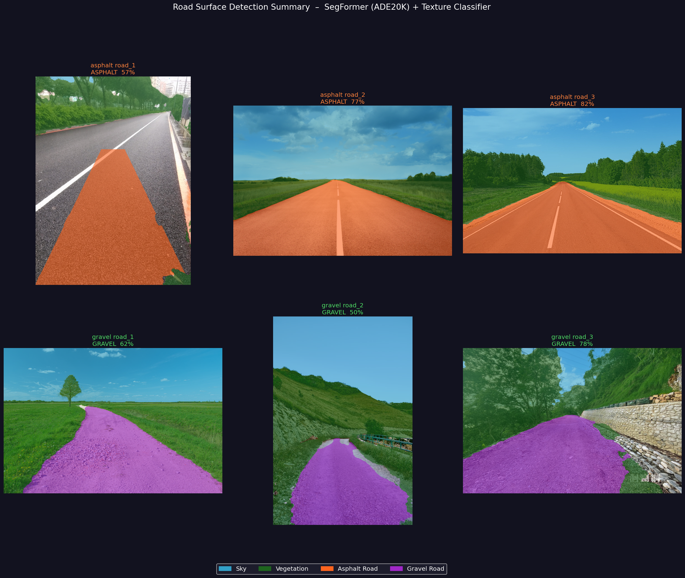
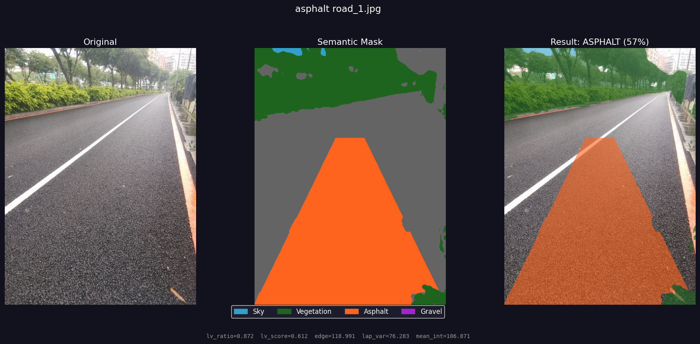
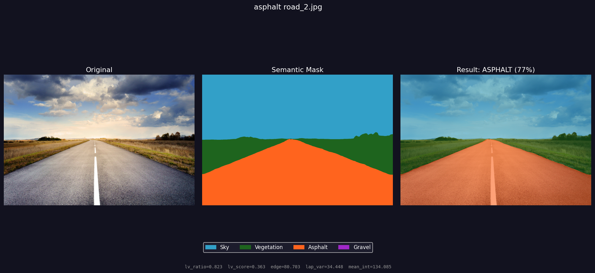
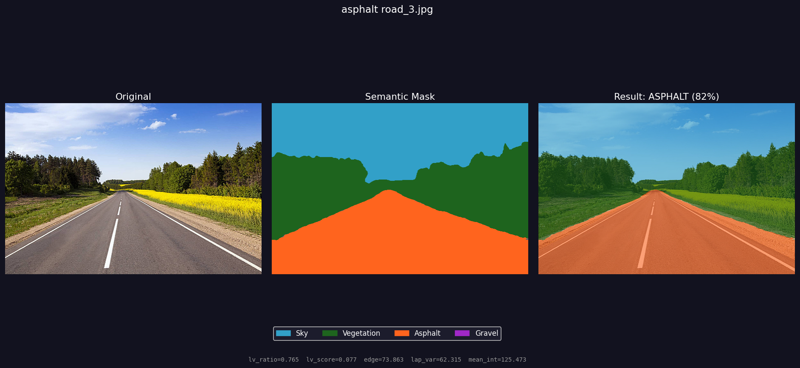
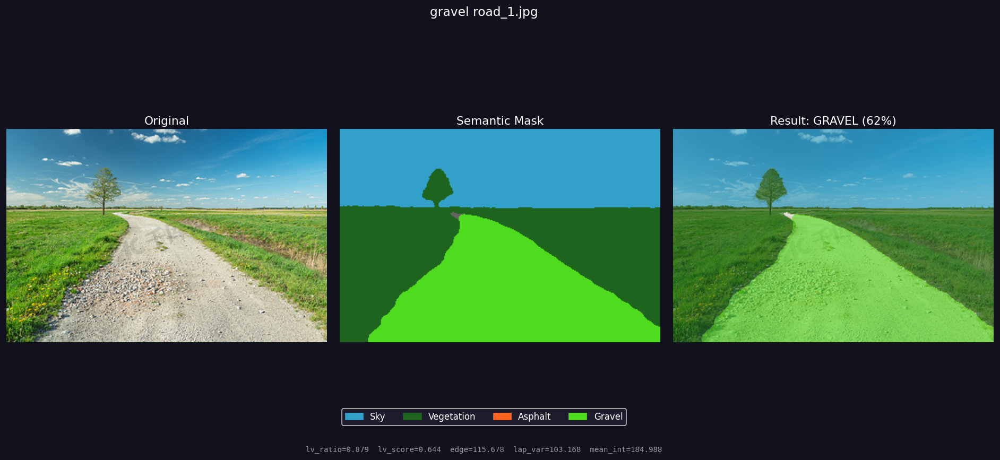
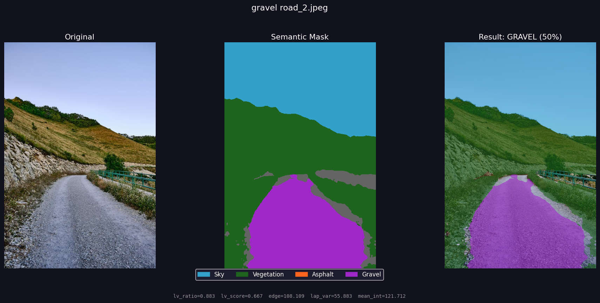
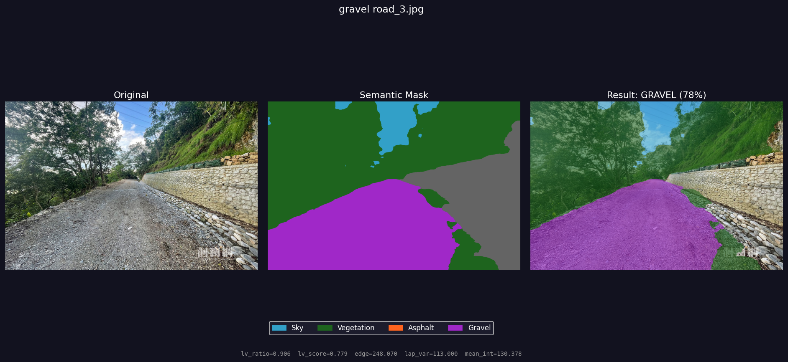

# 道路表面偵測：碎石路 vs 柏油路

利用語意分割（Semantic Segmentation）技術自動識別道路表面類型（gravel / asphalt），並以不同顏色標示天空、植被與道路區域。

---

## 系統架構

```
輸入圖片
    │
    ▼
SegFormer-B2（ADE20K 預訓練）     ← 語意分割：道路 / 天空 / 植被 / 其他
    │
    ▼
多特徵紋理分析（Texture Analysis）
    ├── lv_ratio（細/粗局部方差比）  ← 主要判斷依據（權重 35%）
    ├── Sobel 邊緣密度               （權重 25%）
    ├── Laplacian 方差               （權重 25%）
    └── 平均亮度                     （權重 15%）
    │
    ▼
加權分數 → Gravel（碎石路）或 Asphalt（柏油路）
    │
    ▼
多類別彩色疊加輸出圖片
```

---

## 顏色對照表

| 區域 | 顏色 |
|------|------|
| 天空（Sky） | 天藍色 |
| 植被 / 路邊（Vegetation） | 深綠色 |
| 柏油路（Asphalt） | 橘色 |
| 碎石路（Gravel） | 紫色 |
| 其他（Other） | 灰色 |

---

## 輸出結果對照

### 整體總結（6 張）



---

### 逐張前後對照（原圖 / 語意遮罩 / 結果）

#### 柏油路（Asphalt）







#### 碎石路（Gravel）







---

## 技術細節

### 道路遮罩後處理流程

1. **空間先驗截斷**：道路遮罩限制在圖片下方 65%，排除天空與遠景的誤判。

2. **形態學閉運算（MORPH_CLOSE，kernel 11×11）**
   - 先做**膨脹（Dilation）**再做**侵蝕（Erosion）**
   - 效果：填補道路遮罩中因車道線、積水反光等造成的小破洞，讓道路區域保持連續完整
   - 使用橢圓形 kernel 以避免方形截角

3. **形態學開運算（MORPH_OPEN，kernel 11×11）**
   - 先做**侵蝕（Erosion）**再做**膨脹（Dilation）**
   - 效果：移除道路遮罩外側的散落雜訊小區塊（如路旁植被被誤判為道路的像素），不影響主要道路主體

4. **最大連通分量（Connected Components）**
   - 使用 `cv2.connectedComponentsWithStats` 計算各連通區域面積
   - 僅保留最大連通分量，確保只標記主要道路，去除邊緣殘留小區塊

5. **透視漸層收窄（Gradient Taper，僅覆蓋率 > 45% 時啟用）**
   - 針對特殊情況（如下雨天柏油路反光導致 SegFormer 將下半部全部判斷為道路）
   - 每一 row 保持 SegFormer 偵測的道路中心位置，但寬度從底部 100% 線性收縮至頂部 15%
   - 視覺上產生自然的「道路消失點」透視效果，避免橘色以矩形平舖在畫面底部

6. **分類遮罩 vs 視覺遮罩分離**
   - `road_mask`（完整 SegFormer 遮罩）：供紋理分析使用，統計範圍更廣，分類更穩定
   - `road_vis_mask`（漸層收窄後的遮罩）：僅用於顏色疊加的視覺輸出

7. **EXIF 旋轉校正**：使用 `PIL.ImageOps.exif_transpose` 支援手機直拍圖片的自動方向校正
